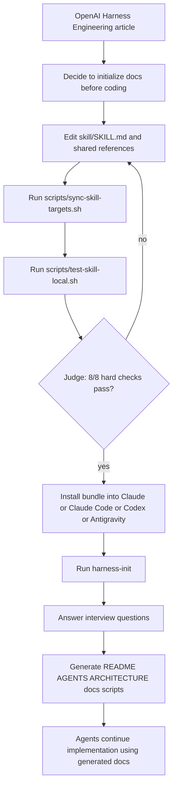

# Harness Engineering Skill

OpenAI의 하네스 엔지니어링 글을 읽고 나면, 에이전트에게 바로 기능 개발을 시키기 전에 먼저 문서 구조와 운영 규칙부터 잡아야 한다는 점이 분명해집니다.
이 저장소는 그 첫 단계만 따로 떼어낸 `harness-init` 스킬 저장소입니다.
프로젝트 초기에 `README.md`, `AGENTS.md`, `ARCHITECTURE.md`, `docs/` 구조를 먼저 만들고, 그 문서를 바탕으로 에이전트가 이후 개발을 이어가도록 설계했습니다.

핵심 원본은 `skill/`에만 두고, Claude, Claude Code, Codex, Antigravity용 배포 번들은 `targets/`로 동기화합니다.

## Why

에이전트 기반 개발에서 가장 자주 생기는 문제는 시작 문맥이 비어 있다는 점입니다.
코드를 만들기 전에 아래 항목이 먼저 정리되지 않으면 작업이 쉽게 흔들립니다.

- 어떤 문서를 먼저 읽어야 하는지
- 어떤 구조를 안정적인 시스템 맵으로 볼지
- 어떤 TODO와 실행 계획을 남겨야 하는지
- 어떤 제약과 완료 기준을 따라야 하는지

`harness-init`는 이 문제를 해결하기 위해 만들어졌습니다.
즉 이 스킬은 기능 구현 스킬이 아니라, 프로젝트를 에이전트 친화적인 작업 공간으로 초기화하는 스킬입니다.

## What This Repository Is

이 저장소는 "문서 생성 스킬의 원본 + 배포 번들 + 기준 예시"를 함께 관리하는 레포입니다.
폴더마다 역할이 다르고, 내용도 의도적으로 서로 다릅니다.

| Directory | Role | Why It Looks Different |
| --- | --- | --- |
| `skill/` | 스킬의 원본 | 실제 수정이 일어나는 canonical source이기 때문입니다. |
| `targets/` | 툴별 배포 번들 | `skill/`을 각 런타임 형식에 맞게 복사한 결과물이기 때문입니다. |
| `starter-kit/` | 생성 결과의 정적 예시 | 스킬이 만들 수 있는 문서 모양의 reference sample이기 때문입니다. |
| `scripts/` | 배포 번들 동기화 자동화 | 사람이 직접 만지지 않도록 sync 로직만 둡니다. |
| `docs/` | 이 저장소 자체의 설계 문서 | 스킬 사용 대상 프로젝트 문서가 아니라, 이 저장소를 설명하는 문서입니다. |

`skill/`은 canonical source를 보관하고, `starter-kit/`은 생성 결과의 정적 기준 예시를 보관하며, `targets/`는 각 런타임에 맞게 패키징된 배포 번들을 보관합니다.

## What The Skill Generates

`harness-init`는 프로젝트 인터뷰를 바탕으로 아래 문서 집합을 생성하도록 설계되어 있습니다.

항상 생성되는 핵심 문서:

- `README.md`
- `AGENTS.md`
- `ARCHITECTURE.md`
- `docs/design-docs/index.md`
- `docs/design-docs/core-beliefs.md`
- `docs/exec-plans/tech-debt-tracker.md`
- `docs/product-specs/index.md`
- `docs/references/*-llms.txt`
- `scripts/init.sh`

프로젝트 특성에 따라 추가로 생성될 수 있는 선택 문서:

- `docs/exec-plans/active/EP-xxxx.md`
- `docs/exec-plans/completed/EP-xxxx.md`
- `docs/generated/db-schema.md`
- `docs/product-specs/<feature>.md`
- `docs/DESIGN.md`
- `docs/FRONTEND.md`
- `docs/PLANS.md`
- `docs/PRODUCT_SENSE.md`
- `docs/QUALITY_SCORE.md`
- `docs/RELIABILITY.md`
- `docs/SECURITY.md`

`starter-kit/`은 확장된 결과 예시를 포함할 수 있고, 위 핵심 목록은 공통적으로 필요한 최소 문서 집합을 설명합니다.

## Who

이 저장소는 아래 사용자를 대상으로 합니다.

- 새 프로젝트를 시작할 때 문서 구조를 먼저 잡고 싶은 사람
- Codex, Claude Code 같은 에이전트 도구를 실제 개발 루프에 넣으려는 사람
- 여러 런타임에서 같은 스킬 계약을 유지하고 싶은 사람

## Supported Tools

아래 런타임을 배포 대상으로 유지합니다.

| Tool | Support Type | Bundle Path | Run Method |
| --- | --- | --- | --- |
| Claude | Upload bundle | `targets/claude/harness-init/` | ZIP으로 묶어 custom skill 업로드 |
| Claude Code | Filesystem skill | `targets/claude-code/harness-init/` | `~/.claude/skills/harness-init/`에 복사 |
| Codex | Filesystem skill | `targets/codex/harness-init/` | `.codex/skills/harness-init/`에 복사 |
| Antigravity | Prompt adapter | `targets/antigravity/harness-init/` | `PROMPT.md`를 project prompt 또는 agent rules에 붙여 넣기 |

## How It Works

이 저장소의 기본 흐름은 아래와 같습니다.

1. `skill/`에서 canonical `harness-init`를 수정합니다.
2. `bash scripts/sync-skill-targets.sh`를 실행합니다.
3. `bash scripts/test-skill-local.sh`로 로컬 평가 루프를 돌려 스킬이 올바른 문서를 생성하는지 검증합니다.
4. `targets/`에 생성된 런타임별 번들을 설치합니다.
5. 각 도구에서 `harness-init`를 호출해 프로젝트 문서 구조를 먼저 생성합니다.
6. 그다음 생성된 문서를 바탕으로 에이전트가 기능 개발을 이어갑니다.

다이어그램으로 보면 아래 흐름입니다.



질문 기반 동작 흐름은 아래처럼 이해하면 됩니다.

```text
project context input
-> interview questions
-> harness document set generation
-> evaluation loop (Run phase + Judge phase)
-> execution plan and references become available
-> implementation agents read the docs
-> project development starts with shared context
```

## Quick Start

Codex에 바로 붙여보려면 아래처럼 하면 됩니다.

```bash
bash scripts/sync-skill-targets.sh
mkdir -p .codex/skills/harness-init
cp targets/codex/harness-init/SKILL.md .codex/skills/harness-init/
cp -R targets/codex/harness-init/references .codex/skills/harness-init/
cp -R targets/codex/harness-init/scripts .codex/skills/harness-init/
```

이후 Codex 세션에서 아래처럼 요청하면 됩니다.

```text
Use the harness-init skill to scaffold the project operating documents before implementation starts.
```

## How To Use In Each Tool

지원 툴마다 실행 방식이 다릅니다.

### Claude

1. `targets/claude/harness-init/`를 ZIP으로 묶습니다.
2. Claude custom skill 화면에서 업로드합니다.
3. 프로젝트 초기화 요청과 함께 `harness-init`를 실행합니다.

### Claude Code

1. `targets/claude-code/harness-init/`를 skill 디렉토리에 복사합니다.
2. 세션에서 `harness-init`를 호출합니다.
3. 인터뷰 질문에 답하면 문서 구조가 생성됩니다.

### Codex

1. `targets/codex/harness-init/`를 `.codex/skills/harness-init/`로 복사합니다.
2. Codex 세션에서 `harness-init`를 사용하라고 요청합니다.
3. 질문에 답하면 프로젝트 문서 세트가 만들어집니다.

### Antigravity

1. `targets/antigravity/harness-init/PROMPT.md`를 프로젝트 프롬프트나 rules에 붙입니다.
2. 같은 workflow를 따라 인터뷰 기반으로 문서 구조를 생성하게 합니다.

## Install

### Claude

`targets/claude/harness-init/` 디렉토리를 ZIP으로 묶어 Claude의 custom skill 업로드 화면에 넣으면 됩니다.

### Claude Code

```bash
mkdir -p ~/.claude/skills/harness-init
cp targets/claude-code/harness-init/SKILL.md ~/.claude/skills/harness-init/
cp -R targets/claude-code/harness-init/references ~/.claude/skills/harness-init/
cp -R targets/claude-code/harness-init/scripts ~/.claude/skills/harness-init/
```

### Codex

```bash
mkdir -p .codex/skills/harness-init
cp targets/codex/harness-init/SKILL.md .codex/skills/harness-init/
cp -R targets/codex/harness-init/references .codex/skills/harness-init/
cp -R targets/codex/harness-init/scripts .codex/skills/harness-init/
```

### Antigravity

Antigravity는 filesystem skill 번들 대신 prompt adapter로 사용합니다.
`targets/antigravity/harness-init/PROMPT.md`를 프로젝트 프롬프트 또는 agent rules 위치에 붙여 넣고, 필요하면 같은 디렉토리의 `INSTALL.md`를 따라 references와 scripts를 같이 옮기면 됩니다.

## Directory Review

프로젝트를 읽을 때는 아래 순서로 이해하면 됩니다.

1. `skill/`
   여기서 스킬 원본을 읽습니다. 실제 로직은 여기 있습니다.

2. `skill/references/`
   스킬이 어떤 문서 세트를 생성해야 하는지 규칙을 봅니다.

3. `skill/runtime-guides/`
   런타임별로 설치 방식이 어떻게 다른지 봅니다.

4. `targets/`
   각 런타임에 실제로 배포되는 결과물이 어떻게 생겼는지 봅니다.

5. `starter-kit/`
   생성 결과가 어떤 모양을 가질 수 있는지 예시를 봅니다.

## Testing & Evaluation

### 번들 구조 검사 (모델 호출 없음)

```bash
bash scripts/check-bundle-structure.sh
```

Claude, Claude Code, Codex, Antigravity 네 런타임의 배포 번들이 필수 파일과 SKILL.md 프론트매터를 갖추고 있는지 결정론적으로 검사합니다.
API 비용이 없으며 CI에서도 동일하게 실행됩니다.

### 로컬 평가 루프 (Claude Code CLI 사용)

```bash
bash scripts/test-skill-local.sh
```

두 단계로 스킬을 end-to-end 검증합니다.

- Run phase: `tests/fixtures/interview.json`의 인터뷰 답변을 사용해 임시 샌드박스 안에서 `harness-init`를 실행하고 문서를 생성합니다.
- Judge phase: 생성된 파일 트리와 `tests/judge-rubric.md`를 Claude에 넘겨 8개 하드 체크리스트와 4개 정성 지표를 채점합니다.

결과 리포트는 `tests/reports/<ISO8601>/report.md`에 저장됩니다.
하드 체크리스트 항목 중 하나라도 `[FAIL]`이면 스크립트가 exit 1로 종료됩니다.

Anthropic API 키가 아닌 Claude Code CLI 구독을 사용하므로 별도 API 비용이 없습니다.

### tests/ 디렉토리 구조

```text
tests/
├── fixtures/
│   └── interview.json        # 평가용 샘플 인터뷰 답변 (acme-orders 프로젝트)
├── prompts/
│   └── run.md                # Run phase 지시 프롬프트
├── judge-rubric.md           # Judge phase 평가 기준 (8 hard checks + 4 rubric axes)
└── reports/                  # 평가 결과 (gitignore 처리됨)
    └── <ISO8601>/
        ├── run-stdout.log
        ├── report.md
        └── generated/        # 스킬이 생성한 파일 스냅샷
```

## Sync

`targets/`는 직접 수정하지 않는 것이 원칙입니다.
핵심 스킬을 수정한 뒤에는 아래 명령으로 번들을 다시 생성해야 합니다.

```bash
bash scripts/sync-skill-targets.sh
```

동기화 후에는 아래 검사를 권장합니다.

```bash
bash starter-kit/scripts/lint-architecture.sh docs/design-docs
bash starter-kit/scripts/check-doc-links.sh .
bash -n scripts/sync-skill-targets.sh
bash -n skill/scripts/scan-project.sh
bash scripts/check-bundle-structure.sh
bash scripts/test-skill-local.sh
```

## Repository Structure

```text
.
├── README.md
├── AGENTS.md
├── ARCHITECTURE.md
├── docs/
├── scripts/
├── skill/
├── starter-kit/
├── targets/
└── tests/
```

각 디렉토리의 역할은 아래와 같습니다.

- `skill/`: canonical `harness-init` source
- `targets/`: 런타임별 배포 번들
- `scripts/`: bundle sync, 구조 검사, 로컬 평가 자동화
- `starter-kit/`: 생성 결과의 정적 기준 예시
- `docs/`: 이 저장소 자체의 설명과 설계 근거
- `tests/`: 평가용 fixture, 프롬프트, Judge 루브릭

## Repository Map

- `AGENTS.md`: 이 저장소 자체를 위한 에이전트 진입점
- `ARCHITECTURE.md`: 이 저장소 자체의 구조 설명
- `docs/design-docs/`: 설계 상세와 근거 문서
- `docs/references/harness-engineering.md`: 핵심 원칙 참조
- `skill/`: `harness-init`의 canonical source
- `targets/`: 런타임별 배포 번들
- `starter-kit/`: 생성 결과의 정적 기준 예시

## References

이 저장소의 구조와 생성 규칙은 아래 문서를 참고합니다.

- OpenAI: [하네스 엔지니어링: 에이전트 우선 세계에서 Codex 활용하기](https://openai.com/ko-KR/index/harness-engineering/)
- matklad: [ARCHITECTURE.md](https://matklad.github.io/2021/02/06/ARCHITECTURE.md.html)

## CI

루트 GitHub Actions는 push 및 pull request마다 아래 검증을 실행합니다.

- 루트 `docs/`와 `starter-kit/docs/`의 Markdown 및 아키텍처 문서 검사
- `starter-kit/scripts/`, `skill/scripts/`, `scripts/`의 셸 문법 검사
- `bash scripts/sync-skill-targets.sh` 실행
- `bash scripts/check-bundle-structure.sh`로 네 런타임 번들의 필수 파일, SKILL.md 프론트매터, 상대 링크 무결성 검사
- 동기화 후 worktree가 깨끗한지 검사

> [!NOTE]
> CI는 모델을 호출하지 않습니다. LLM-as-judge 평가(`test-skill-local.sh`)는 스킬을 수정할 때 로컬에서 직접 실행해야 합니다.
